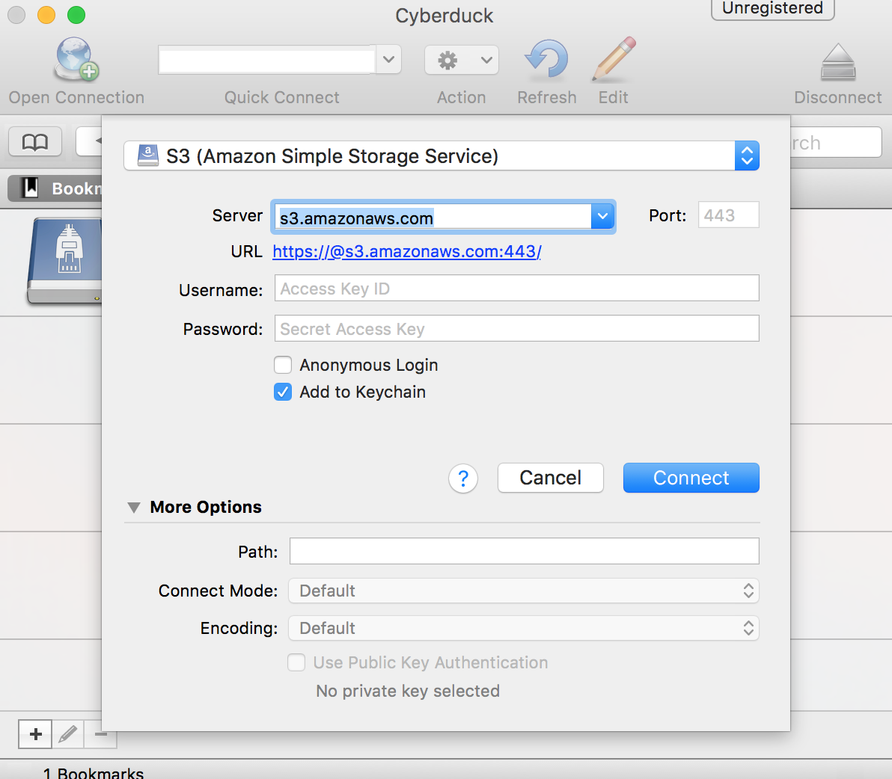
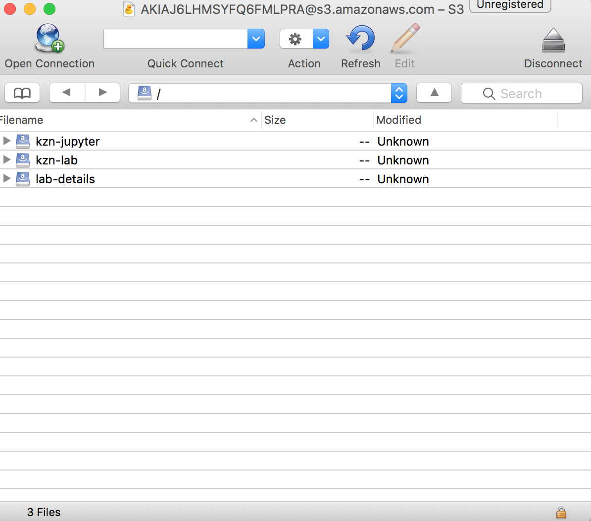
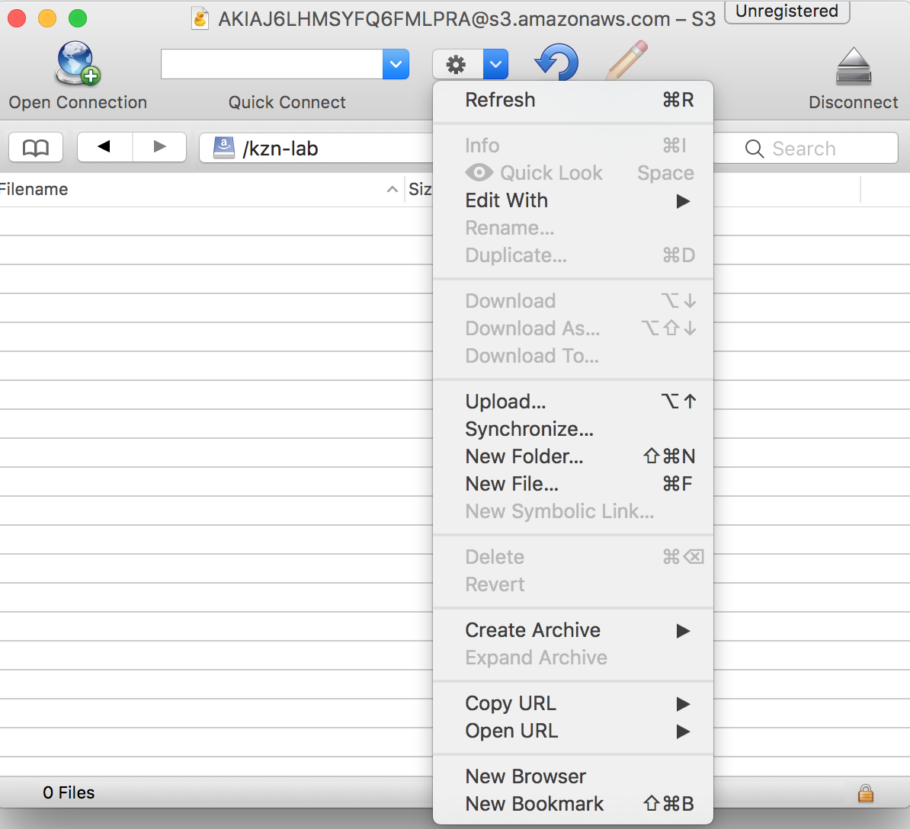
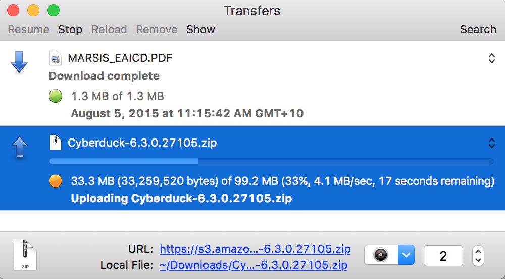
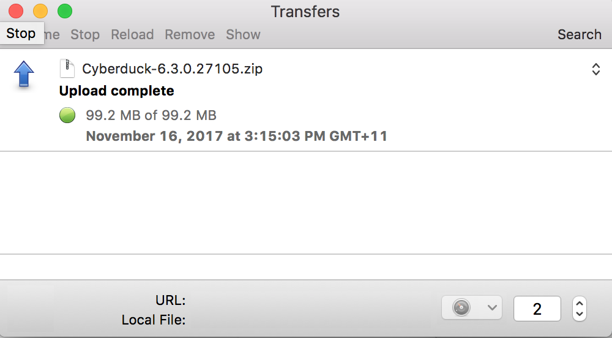
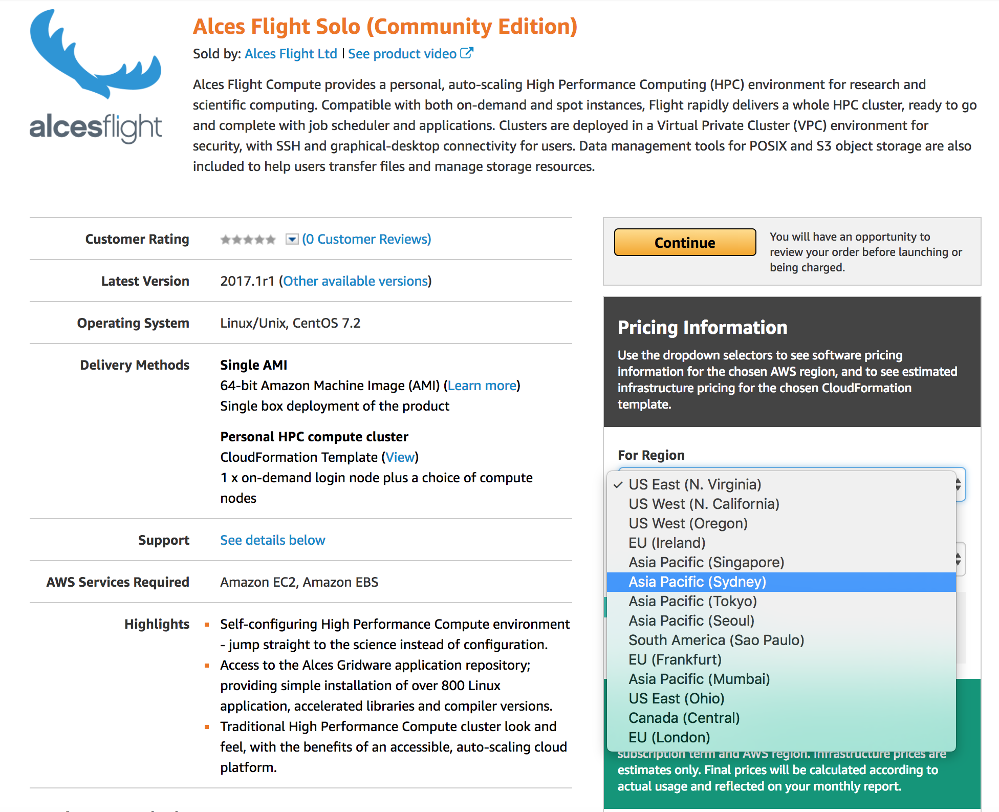
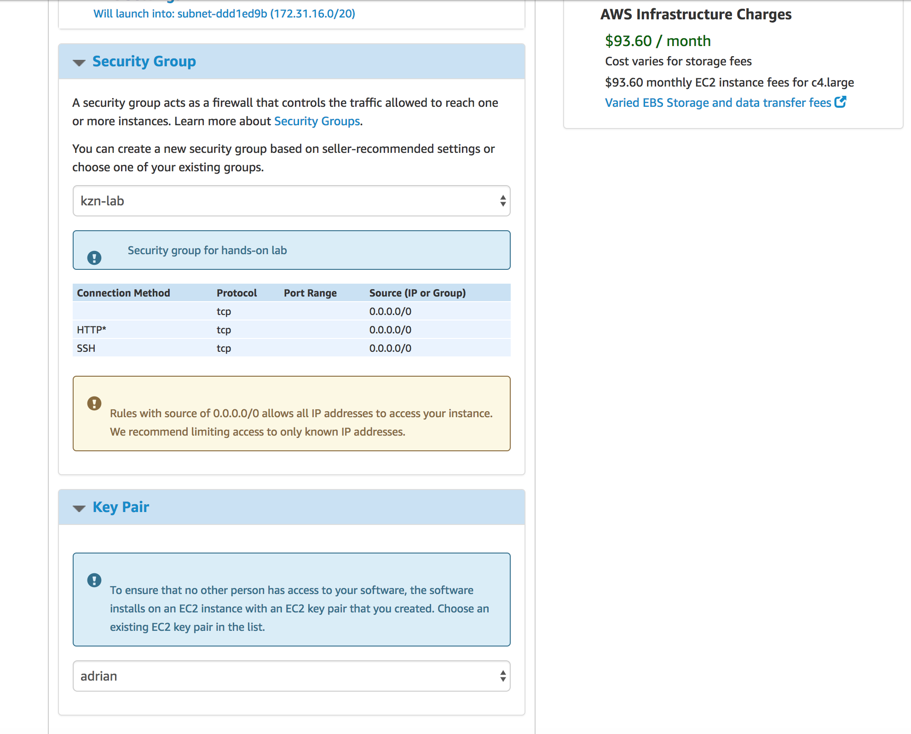
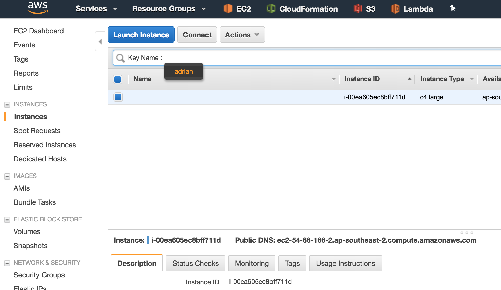
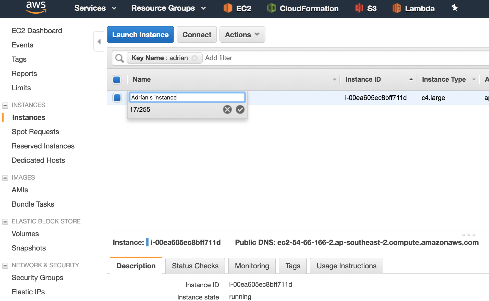
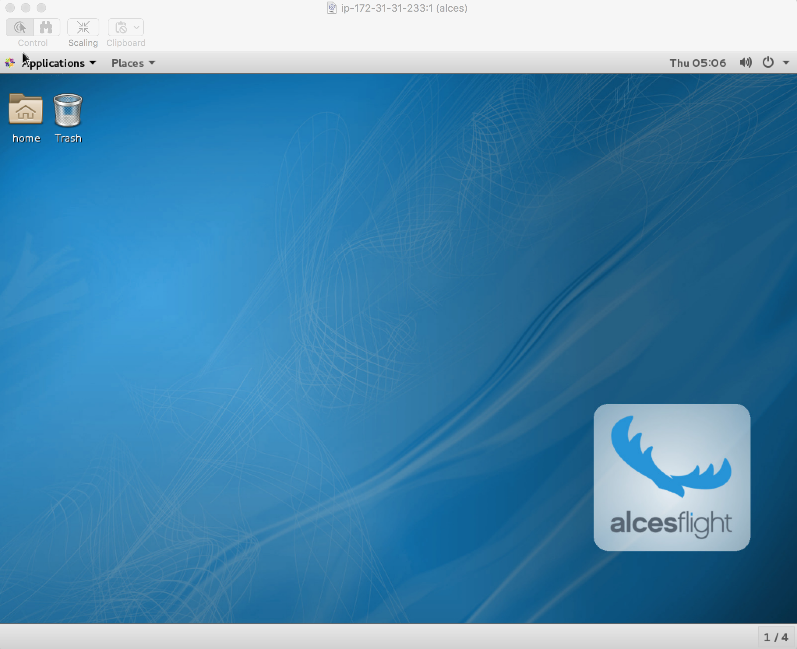

# Introduction to Research Computing on AWS
## Introduction

In this lab, you will be introduced to the basic tools required to get started with Research Computing on AWS. A key ingredient for any research work is data. We’ll show you how to move data into and out of the AWS cloud efficiently and securely using the AWS CLI tool and Amazon S3.

When it comes to processing and analyzing that data, AWS offers a massive array of tools and platforms you might be interested in; from small to very large computers, powerful virtual scientific workstations with GPUs for data visualisation, big data tools like Hadoop and Spark, relational databases like Postgres (with PostGIS for geospatial work), and even your own personal HPC clusters in the cloud.

We’ll start at the beginning though. After moving data into S3, we’ll show you how to start your own powerful Linux workstation using a AWS partner solution called Alces Flight. To start with, this will give you a very capable Linux workstation in the cloud, with lots of software at your fingertips ready to install. We’ll install some scientific software and interact with the data we’ve moved into S3. Once we’ve done that though, we’ll show you how easy it is to turn this simple workstation into your own personal HPC cluster. The focus of this lab won’t be on HPC, but we have other courses we run that teach you how to do scalable high throughput or high performance work on AWS using tools like Alces Flight and AWS Batch or how to do big data analytics on AWS using Apache Hadoop and Spark with Amazon EMR etc.

The great thing about AWS is you can start simply and with a small amount of resources, but quickly scale that up to some of the largest infrastructure in the world if you need it. You get to decide what you need, and you have complete control over what scale of resources you use. We think you’ll be pleasantly surprised at how easy it is to get started doing meaningful research work on the cloud!

## Technical Knowledge Prerequisites

To successfully complete this lab, you should be familiar with the following:

- Introductory familiarity with SSH and Linux
- Command line familiarity – copy files/data
- Linux desktop (e.g. Gnome) experience not necessary, but helpful

## Topics Covered

This lab will take you through:

- Creating Jupyter Notebook environments on AWS
- Using very simple notebook examples to step through and interactively run code in your Jupyter Notebook environment on AWS
- Explore [Apache MXNet](http://mxnet.io/) to develop, train and evaluate deep learning models using GPUs in AWS

## Sign in to the AWS Management Console

Using your AWS account to sign in to the AWS Management Console
Welcome to this self-paced lab! The first step is for you to sign in to Amazon Web Services.

1. In this lab we are going to be using an existing AWS account. Prior to the lab you will have been given an IAM user with a username and password, and a URL to the AWS IAM console login screen. Browse to that URL and use the username and password credentials to login into the AWS console.  
  
  

2. **AWS Region** – all the work you do today will be in a single AWS region. Please check with the lab instructor which AWS region you should use.

## Creating an Amazon EC2 Key Pair

1. Browse to the EC2 console
2. In the left hand navigation menu, under the ‘Network & Security’ section, click **Key Pairs**
3. Click the **Create Key Pair** button
4. Give your Key Pair a unique name, e.g. **lab61**
5. Click the **Create** button

The EC2 console will now download the private key for your newly created key pair. Before we can use the private key we’ll need to update the permissions on it. To do this type:

    chmod 0400 lab61.pem

Don’t lose this and store it in a safe place! It effectively authenticates you when using AWS programmatically. You don’t want someone else impersonating you or using your credentials. We’ll be using this private key later in the lab.

# Module 1 - Moving research data into and out of Amazon S3

Very often you'll want to move data efficiently into the cloud so you can work on it.

There are a number of ways of doing this. One common way of moving data around quickly and securely is to use the [AWS CLI](https://aws.amazon.com/cli/). There are other graphical user interface tools that make it easy to move data into and out of AWS too, like [Cyberduck](https://cyberduck.io/). This is what we'll be using today.

## Installing Cyberduck

Go to the [Cyberduck website](https://cyberduck.io/), download the client for your operating system (Windows or OS X), and install it. Once installed, run the program. You should see something similar to this:

What we need to do is configure our AWS credentials to securely authenticate and connect to the S3 service. This will let us view buckets, and upload data. We've already created an S3 bucket for you called **kzn-lab** and we'll be using that today as the target we'll upload data to and from.

To do this, we'll need to create a new connection to S3. In your Cyberduck application, click **Open Connection**. You should see something like the following:

Here we'll need our **AWS Access Key ID** and **AWS Secret Access Key ID** for the lab user we're using. You'll get this from the lab environment details page for the user you logged into the AWS lab account with.

Take your **Access Key ID** and your **Secret Access Key ID** and copy/paste them into Cyberduck. Once done, click the **Connect** button.

If you were successful, you should see one or more S3 buckets. One of which should be called **kzn-lab**:

We'll use the **kzn-lab** bucket to move data into and out of the cloud.

## Uploading data

To upload data, double click on the **kzn-lab** bucket and make sure you've navigated to it. You should see the contents of the bucket now (either empty or with some data in it from other users).

From Cyberduck again, click the **Actions** dropdown. You should see the following actions:

Click **upload** and browse to a local file on your laptop you'd like to upload. Bear in mind, this is shared bucket. Everyone in the lab account has access to it. Within your own AWS account you will be the only person who can see and share data (by default), unless you choose to open up access to other users. How to do this securely is beyond the scope of this lab, but if you'd like to learn more about securely sharing data in Amazon S3 have a look at [Managing Access Permissions to Your Amazon S3 Resources](http://docs.aws.amazon.com/AmazonS3/latest/dev/s3-access-control.html).

Once you've started uploading data, Cyberduck will give you a nice indication of the progress of your upload:

Once your upload is complete, you should see:

## A few words on Amazon S3

It's worth making a few comments about Amazon S3. S3 is designed to provide 99.999999999% durability and 99.99% availability. In the Sydney AWS region, it costs roughly 2.5c per GB per month for data stored there. It

There are also different storage tiers which are even more cost effective. To learn more, visit [Amazon S3 Pricing](https://aws.amazon.com/s3/pricing/).

Some of the largest research datasets in the world are stored in S3 and accessed incredibly frequently and at massive scale by researchers all around the globe. For example, all of our [AWS Open Data](https://aws.amazon.com/opendata) datasets are stored on S3. Some of the more interesting datasets you can use for free are available at [Earth on AWS](https://aws.amazon.com/earth/). In fact, one of the datasets we'll be using today is the [NEXRAD on AWS](https://aws.amazon.com/public-datasets/nexrad/) dataset from the US National Oceanic and Atmospheric Administration (NOAA).

# Module 2 – Creating your first compute environment

In this module we'll create our first compute environment on Amazon EC2. We'll use a tool called [Alces Flight](https://alces-flight.com) to get started quickly. Alces Flight is available in the [AWS Marketplace](https://aws.amazon.com/marketplace).

Today, we'll be using the [Alces Flight Solo (Community Edition)](https://aws.amazon.com/marketplace/pp/B01GC9E3OG?qid=1510807355800).

1. Browse to the [Alces Flight Solo (Community Edition)](https://aws.amazon.com/marketplace/pp/B01GC9E3OG?qid=1510807355800) in the AWS Marketplace.
2. On the right-hand side of the marketplace listing you should see  a **Region** drop-down. Today we're going to be using the **Asia Pacific (Sydney)** region. Please don't try and use the Tokyo or Mumbai or Frankfurt regions. You can try those out later :)  
  
	

3. We'll also make sure we're using the **Single AMI** delivery method. This will give us a usable Alces Flight environment with a single node. This is all we need to get started with our work in the cloud.
4. Once you have these options selected, click the **Continue** button.
4. On the 1-Click Launch screen we need to carefully select the **security group** we'll use to access our compute environment. Make sure you select **kzn-lab** from the dropdown, as below:  
  
	
  
5. We also need to make sure that **our keypair** is selected. **This is important**. If you select the default or someone else's keypair, **you won't be able to connect to your compute environment**.  

	Make sure you select the keypair you created earlier in the lab.

7. Now, scroll back to the top of the screen click the **Launch with one click** button on the right hand side. Your new Alces Flight compute environment is now launching!

Now we want to look at the status of our new compute environment launching from the EC2 console. To do this:

1. Browse back to the EC2 Console, and click on **Instances** again in the left hand navigation. You may see multiple compute environments launching. This is because we are effectively launching many environments in parallel - one for each person doing the lab! The cloud is good at doing things in parallel :)

2. Nevertheless, we want to find **our** compute environment. To do this, we'll filter the instances and use the **Key Name** attribute. To do this, click on the top search box above the list of instanced in the EC2 console, and type **Key Name**. You should see a list of key names autocomplete. See below:

	

	Once you select your keypair name from the list, the filter will only show **your instance**.
	
3. We're going to do one more bit of housekeeping before we finish with the EC2 console. We're going to **tag** our instance so we can find it easily in the future. If you mouseover your instance, you'll see a small pencil icon appear  over the **Name** field. Click on the pencil icon

4. A field will appear. Type something that you'll remember so you can find your instance easily in the future. You can always use filters like we did above, but sometimes it's easier to just see your instance at a glance. For example, I've called my instance:

	
		
	5. Now if you browse back to the EC2 console and list instances again in the future, you'll see your named instance in the list.

## Connecting to your Flight compute environment

We'll now connect to our new compute environment. To do this we'll use SSH.

## Starting a Linux desktop session

## Connecting to your Linux desktop session over VNC

Once you've connected to your Linux desktop on your Flight compute environment you should see:

Now we're getting somewhere!

## Mapping NEXRAD Radar data with CartoDB

The following section was taken from an excellent tutorial by [Stuart Lynn](https://carto.com/blog/author/stuart-lynn/) published on the [Carto.com](https://carto.com/) blog, called [Mapping NOAA NEXRAD radar data with CartoDB](https://carto.com/blog/mapping-nexrad-radar-data/).

You can copy files from the NEXRAD archive by using the AWS CLI on your flight compute environment:

For example:

	aws s3 cp aws s3 cp s3://noaa-nexrad-level2/2014/07/03/KMHX/KMHX20140703_182118_V06.gz ./

We'll install NOAA's Climate Toolkit. To do this, [download the Linux version](https://www.ncdc.noaa.gov/wct/app/dist/wct-4.0.6.zip).

# Summary

Congratulations! In this lab you created and used your first research compute environment on AWS using Alces Flight.

We used a single instance to do something interesting, but the great thing about Alces Flight (and similar tools on AWS) is that you can start small and then scale to your needs. Alces Flight actually gives you a fully-featured HPC cluster environment on AWS if that's what you need.

Your AWS account team would also love to hear about your use case and what you’re looking to do with AWS.

**Have fun, and remember, don’t forget to the turn your AWS resources off when you leave the room!**

# Additional Resources

AWS Research and Technical Computing

	https://aws.amazon.com/rtc

AWS Open Data

	https://aws.amazon.com/opendata

Alces Flight

	https://alces-flight.com/

For feedback, suggestions, or corrections, please email Adrian White at **whiteadr@amazon.com**

